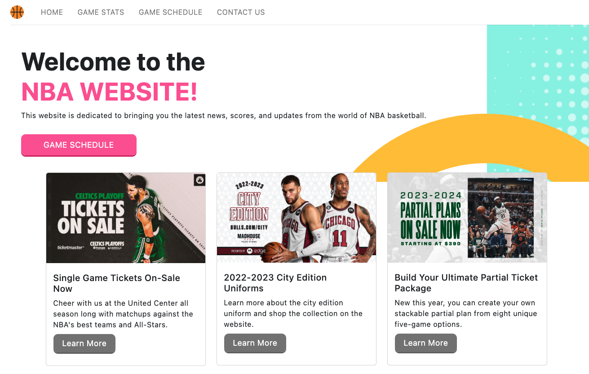

# NBA-website
This is a website built with React and Bootstrap that displays NBA team information and rosters. It uses the official NBA API to fetch team and player data.
## Features:
* Displays basic information for all NBA teams
* Shows current season game stats
* Shows upcoming schedule
* Includes a contact form powered by Formspree

## Installation:
To run this project locally, you'll need to have Node.js and npm installed on your machine.

1. Clone this repository to your local machine
2. Navigate to the project directory and run npm install
3. Start the development server with npm start

## API:
This project uses the sportsdata.io and balldontlie.io NBA API to fetch team and game data. It is also integrated with Formspree to handle the contact form submissions.

## File Structure
The project is structured as follows:

    ├── public/
    │   ├── index.html
    ├── src/
    │   ├── components/
    │   │   ├── Header.js
    │   │   ├── Teams.js
    │   │   └── Gallery.js
    │   ├── pages/
    │   │   ├── Contact.js
    │   │   ├── Home.js
    │   │   └── Stats.js
    │   │   └── Sehedule.js
    │   ├── App.js
    │   ├── index.js
    │   └── index.css
    └── package.json

* public/: Contains the index.html file and project images.

* src/: Contains the source code for the React components and pages.

* src/components/: Contains the reusable components used in the pages.

* src/pages/: Contains the main pages of the website.

* src/App.js: Contains the routing and overall app structure.

* src/index.js: Contains the code to render the app to the DOM.
* package.json: Contains the dependencies and scripts for the project.

## Dependencies
This project uses the following dependencies:

    "@formspree/react": "^2.4.1",
    "@testing-library/jest-dom": "^5.16.5",
    "@testing-library/react": "^13.4.0",
    "@testing-library/user-event": "^13.5.0",
    "axios": "^1.3.4",
    "bootstrap": "^5.2.3",
    "react": "^18.2.0",
    "react-bootstrap": "^2.7.2",
    "react-dom": "^18.2.0",
    "react-router-dom": "^6.9.0",
    "react-scripts": "5.0.1",
    "reactstrap": "^9.1.6",
    "web-vitals": "^2.1.4"

## Screenshot:

## Deployed URL:
http://velvety-starship-0f2cab.netlify.app

## License:
This project is licensed under the MIT License. See LICENSE for more information.

## Credits
Photo and infomation were from official NBA website.

